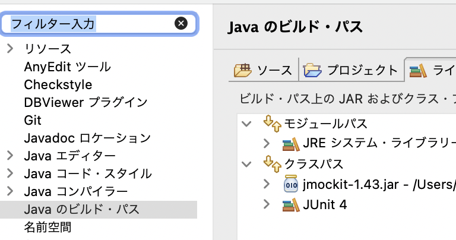

## jmocki1.43

```
https://mvnrepository.com/artifact/org.jmockit/jmockit/1.43
```

- ビルドパス構成

```
クラスパス内のjunitを入れる
外部jarの追加で「jmockit.jar」を入れる
順序をjunitの上にjmockitの上にする。
```



- MockitのJavaエージェントを設定

```
・VM引数にJMockitのJavaエージェントを指定
・テストクラスを右クリックし、メニューから「実行」を選択、「実行の構成」ダイアログをクリック
・VM引数設定：-javaagent:/Users/{users-name}/用しているjarの格納ディレクトリのパス}/jmockit-1.43.jar
```